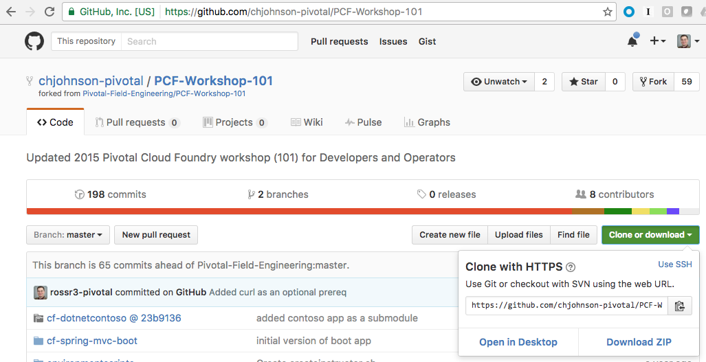

= Pivotal Cloud Foundry 101 Workshop

## Prerequisites 
* JDK 1.8
* link:https://github.com/cloudfoundry/cli/releases[CF CLI]
* (Optional) Git CLI for link:https://github.com/git-for-windows/git/releases/download/v2.9.0.windows.1/Git-2.9.0-64-bit.exe[Windows] or Git from link:https://desktop.github.com/[github.com] 
* (Optional) Curl from link:http://curl.haxx.se/[curl.haxx.se]
* Download or Clone this git repository
* An IDE such as Eclipse, STS, or IntelliJ

## Initial Steps
=== Proxy Setup

If your environment requires a proxy to access resources on the internet, you need to set a couple of envrionment variables in a terminal (Mac) or commmannd prompt (Windows)

For a Mac use these commands:
```
export HTTP_PROXY=<your http proxy>
export HTTPS_PROXY=<your https proxy>
```

For Windows use these commands:
```
set HTTP_PROXY=<your http proxy>
set HTTPS_PROXY=<your https proxy>
```

Validate that you have the CF CLI installed by running the following command:
```
$ cf
cf version 6.22.1+6b7af9c-2016-09-24, Cloud Foundry command line tool
Usage: cf [global options] command [arguments...] [command options]

Before getting started:
  config    login,l      target,t
  help,h    logout,lo

Application lifecycle:
  apps,a        logs      set-env,se
  push,p        ssh       create-app-manifest
  start,st      app
  stop,sp       env,e
  restart,rs    scale
  restage,rg    events

Services integration:
  marketplace,m        create-user-provided-service,cups
  services,s           update-user-provided-service,uups
  create-service,cs    create-service-key,csk
  update-service       delete-service-key,dsk
  delete-service,ds    service-keys,sk
  service              service-key
  bind-service,bs      bind-route-service,brs
  unbind-service,us    unbind-route-service,urs

Route and domain management:
  routes,r        delete-route    create-domain
  domains         map-route
  create-route    unmap-route

Space management:
  spaces         create-space    set-space-role
  space-users    delete-space    unset-space-role

Org management:
  orgs,o       set-org-role
  org-users    unset-org-role

CLI plugin management:
  plugins           add-plugin-repo      repo-plugins
  install-plugin    list-plugin-repos

Commands offered by installed plugins:
  zero-downtime-push    export-gemfire     show-wan-config-url
  disable-diego         gemfire            live-stats
  enable-diego          restart-gemfire
  has-diego-enabled     show-gfsh

Global options:
  --help, -h                         Show help
  -v                                 Print API request diagnostics to stdout

'cf help -a' lists all commands with short descriptions. See 'cf help <command>' to read about a specific command.

```

If you do not see the output from the CF CLI similar to what is shown above, set the CF_HOME environment variable to a writeable folder that already exists on your computer

For a Mac use the following command:
```
$ mkdir /pcf
$ export CF_HOME=/pcf
```

For Windows use the following command:
```
> md /pcf
> set CF_HOME=/pcf
```

And rerun the cf command to verify that it is working correctly.

=== Download or Clone the Git Repository

. If you have git installed on your computer clone the following link:https://github.com/chjohnson-pivotal/PCF-Workshop-101[Repository]
+
```
$ git clone https://github.com/chjohnson-pivotal/PCF-Workshop-101.git
$ cd PCF-Workshop-101
```
+
. If you don't have git installed on your computer, download it from the following  link:https://github.com/chjohnson-pivotal/PCF-Workshop-101[Git Repository]
+

+
. After downloading the zip file, uncompress it to a location of your choice. Then change into that directory
+
```
$ cd PCF-Workshop-101-master
```
+
Note the difference in folder names if you clone the repository vs downloading it. 

## Section 1
* Lab 1 - From Zero to Pushing Your First Application
** link:labs/lab1/lab.adoc[**Java** Application]
** link:labs/lab1/lab-ruby.adoc[**Ruby** Application]
** link:labs/lab1/lab-node.adoc[**NodeJS** Application]
* link:labs/lab2/lab.adoc[Lab 2 - Binding to Cloud Foundry Services]
* link:labs/lab3/lab.adoc[Lab 3 - Operating Your Application]
* link:labs/lab4/lab.adoc[Lab 4 - Monitoring Your Application]

## Section 2
* link:spring-boot-rest-redist-tutorial/README.adoc[Building a Spring Boot Application using REST and Redis]
* link:fortune-teller/README.adoc[Advanced Lab - Spring Cloud Services _**Java** Only_]

## Section 3
* link:labs/lab8/lab.adoc[Lab - Building Pipelines using Concourse.ci]

[comment]: * link:labs/lab6/lab.adoc[Advanced Lab - Deploying a .NET Application]
[comment]: * link:labs/lab7/lab.adoc[Advanced Lab - Deploying a .NET Core Application]

