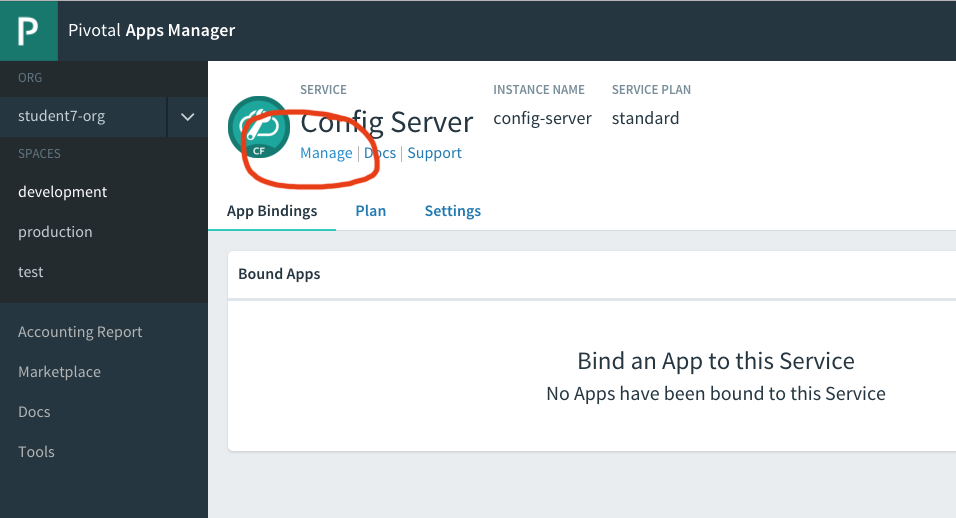
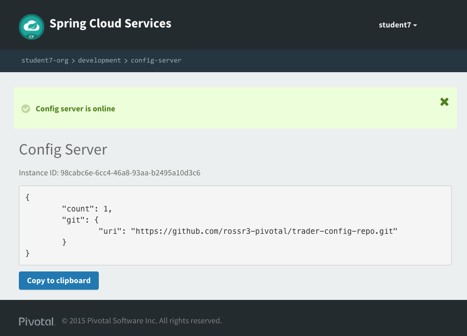

= Configure the Config-Server

One of the benefits of Spring Cloud Services is the ability to configure a running microservice via a github repository. This can be useful especially in situations where localization is needed. This step was done when the create-services script was run. Let's verify the Git repository that we are using.

==== Git Repository

. For this lab we will be using the following repository: https://github.com/rossr3-pivotal/trader-config-repo.git

==== Validate the Config-Server Configuration

. Log into the console at https://apps.run.haas-98.pez.pivotal.io/

. In your space, under services, click the Config Server and select *Manage* next to the *config-server* icon.
+

. Be sure that the configuration looks like this:
+

