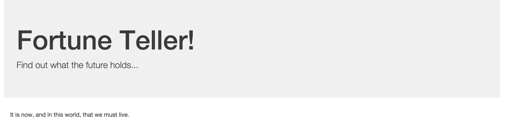

= Fortune Teller

*Fortune Teller* is a very basic application composed of two services:

. link:fortune-teller-fortune-service[Fortune Service] - serves up random Chinese fortune cookie fortunes
. link:fortune-teller-ui[Fortune UI] - presents a UI that consumes the fortune service

It leverages libraries and services from Spring Cloud and Netflix OSS to compose the system.

Fortune Teller is deployable to any Cloud Foundry environment utilizing the service components that have been packaged with the project.
However, it is most easily deployed to Pivotal Cloud Foundry environments that have installed the https://network.pivotal.io/products/p-spring-cloud-services[Spring Cloud Services] package.

== Build

. Change to the fortune-teller folder:
+
----
$ cd ../fortune-teller
----
+
. Using Maven, build and package the application:
+
On a Mac run the following command:
+
----
$ ./mvnw clean package
----
+
On Windows run the following command:
+
----
> mvnw.cmd clean package
----
+
Maven will automatically download all of _Fortune Teller_'s dependencies. This may take a few moments.

== Deploy to Pivotal Cloud Foundry with Spring Cloud Services

. Run `scripts/pcf-create-services.sh` to create the services that you need:
+
On a _Mac_ run the following script:
+
----
$ ./scripts/pcf-create-services.sh
Creating service instance fortunes-db in org student7-org / space test as student7...
OK
Creating service instance config-server in org student7-org / space test as student7...
OK

Create in progress. Use 'cf services' or 'cf service config-server' to check operation status.
Creating service instance service-registry in org student7-org / space test as student7...
OK

Create in progress. Use 'cf services' or 'cf service service-registry' to check operation status.
Creating service instance circuit-breaker-dashboard in org student7-org / space test as student7...
OK

Create in progress. Use 'cf services' or 'cf service circuit-breaker-dashboard' to check operation status.
----
+
On _Windows_ run the following script
+
----
> scripts/pcf-create-services.bat
Creating service instance fortunes-db in org student7-org / space test as student7...
OK
Creating service instance config-server in org student7-org / space test as student7...
OK

Create in progress. Use 'cf services' or 'cf service config-server' to check operation status.
Creating service instance service-registry in org student7-org / space test as student7...
OK

Create in progress. Use 'cf services' or 'cf service service-registry' to check operation status.
Creating service instance circuit-breaker-dashboard in org student7-org / space test as student7...
OK

Create in progress. Use 'cf services' or 'cf service circuit-breaker-dashboard' to check operation status.
----
+
The commands that just ran did the following:

* Created a MySQL database called fortunes-db
* Created a Config Server instance called config-server
* Created a Service Registry instance called service-registry
* Created a Circuit Breaker Dashboard instance called circuit-breaker-dashboard

+
Be sure you look at the script file to see exactly what is happening when the script ran.
+

. Click on the *Manage* links for the *Config Service*, *Service Registry*, and *Circuit Breaker Dashboard*. Make sure the services are finished initializing before you proceed.

+
You can also look at the current state by using the following command:
+
----
$ cf services
Getting services in org student7-org / space test as student7...
OK

name                        service                       plan        bound apps   last operation
circuit-breaker-dashboard   p-circuit-breaker-dashboard   standard                 create in progress
config-server               p-config-server               standard                 create in progress
fortunes-db                 p-mysql                       100mb-dev                create succeeded
service-registry            p-service-registry            standard                 create in progress
workshopDB                  p-mysql                       100mb-dev   workshop     create succeeded
----
+
Be sure that all of the services have been created successfully before proceeding.
+

. Edit the `manifest-pcf.yml` file to specify the Cloud Foundry target the apps are being pushed to, replacing the URL in `TRUST_CERTS: api.run.haas-98.pez.pivotal.io` with the API endpoint for your Cloud Foundry deployment which can be determined by using the following command:
+
----
$ cf api
API endpoint: https://api.run.haas-98.pez.pivotal.io (API version: 2.58.0)
----
+

. Push the microservices:

+
----
$ cf push -f manifest-pcf.yml
----
+
This will push the fortunes service and the ui application and bind all of the services.

== Test the Application

. In a browser, access the fortunes-ui application at the route that was created for you:
+

. Stop the fortunes application:
+
----
$ cf stop fortune-service
----

. Access the fortunes-ui and see that the ``fallback fortune'' is being returned. Note that this default is retrieved from the github repository that was used when the config-service was created above. 
+
image:docs/images/fortunes_4.png[]

. Start the fortunes application:
+
----
$ cf start fortune-service
----

. Continue to access the fortunes-ui. After the fortunes service has re-registered with Eureka and the fortunes-ui load balancer caches are refreshed, you should then start getting random fortunes again!
