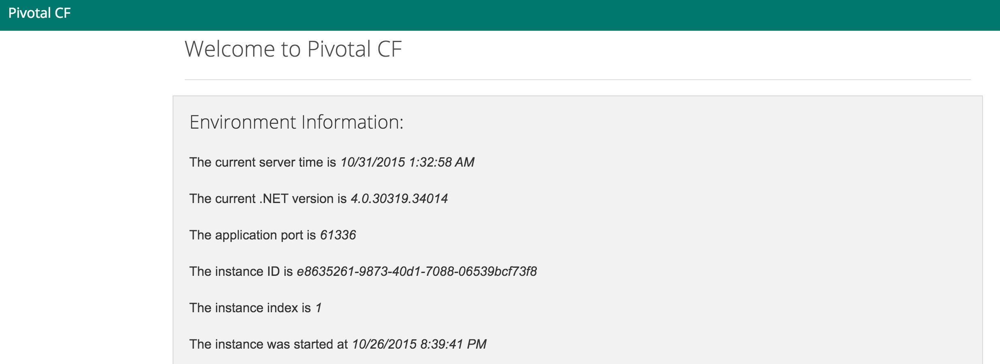
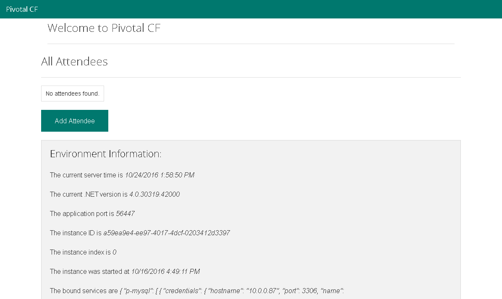

= Lab - Deploying a .NET Application

[abstract]
--
In this lab we will push a .NET web application to cloud foundry.
--

= Lab - From Zero to Pushing Your First Application

== Target

. If you haven't already, download the latest release of the Cloud Foundry command line interface  (CLI) from https://github.com/cloudfoundry/cli/releases for your operating system and install it.

. Set the API target for the CLI: (set appropriate end point for your environment)
+
----
$ cf api https://api.sys.azure.rick-ross.com --skip-ssl-validation
----

. Login to Pivotal Cloudfoundry:
+
----
$ cf login
----
+
Follow the prompts.  You should have a welcome card with your username and password on it.  If you didn't get one, please ask.

== Push It!

. Change to the _ViewEnvironmentt_ application directory (this is the folder containing the code files and manifest.yml):
+
----
$ cd $BOOTCAMP_HOME/pcf-dotnet-environment-viewer/ViewEnvironment
----

. Push the application!
+
----
$ cf push
----
+
You should see output similar to the following listing. Take a look at the listing callouts for a play-by-play of what's happening:
+
====
----
$ cf push
Using manifest file C:\Users\Rick Ross\pcf-dotnet-environment-viewer\ViewEnvironment\manifest.yml

Using stack windows2012R2...
OK
Creating app env in org student7-org / space development as student7...
OK

Creating route env-unagile-meditativeness.app.azure.rick-ross.com...
OK

Binding env-unagile-meditativeness.app.azure.rick-ross.com to env...
OK

Uploading env...
Uploading app files from: C:\Users\Rick Ross\pcf-dotnet-environment-viewer\ViewEnvironment
Uploading 545.7K, 42 files
Done uploading
OK

Starting app env in org student7-org / space development as student7...
Downloading binary_buildpack...
Creating container
Downloaded binary_buildpack
Successfully created container
Downloading app package...
Downloaded app package (748K)
Staging...
Exit status 0
Uploading droplet, build artifacts cache...
Staging complete
Uploading droplet...
Uploading build artifacts cache...
Uploaded build artifacts cache (88B)
Uploaded droplet (732.2K)
Uploading complete
Destroying container
Successfully destroyed container

0 of 1 instances running, 1 starting
1 of 1 instances running

App started

OK

App env was started using this command `..\tmp\lifecycle\WebAppServer.exe`

Showing health and status for app env in org student7-org / space development as student7...
OK

requested state: started
instances: 1/1
usage: 512M x 1 instances
urls: env-unagile-meditativeness.app.azure.rick-ross.com
last uploaded: Mon Oct 24 13:54:32 UTC 2016
stack: unknown
buildpack: binary_buildpack

     state     since                    cpu    memory           disk         details
#0   running   2016-10-24 09:55:08 AM   0.0%   104.8M of 512M   3.8M of 1G

----
<1> The CLI is using a manifest to provide necessary configuration details such as application name, memory to be allocated, the stack to be used (in this case Windows2012R2), the number of instances requested to start, and path to the application artifact.
Take a look at `manifest.yml` to see how.
<2> In most cases, the CLI indicates each Cloud Foundry API call as it happens.
In this case, the CLI has created an application record for _env_ in your assigned space.
<3> All HTTP/HTTPS requests to applications will flow through Cloud Foundry's front-end router called http://docs.cloudfoundry.org/concepts/architecture/router.html[(Go)Router].
Here the CLI is creating a route with random word tokens inserted (again, see `manifest.yml` for a hint!) to prevent route collisions across the default `app.poc-cf.loutms.tree` domain.
<4> Now the CLI is _binding_ the created route to the application.
Routes can actually be bound to multiple applications to support techniques such as http://www.mattstine.com/2013/07/10/blue-green-deployments-on-cloudfoundry[blue-green deployments].
<5> The CLI finally uploads the application bits to Pivotal Cloud Foundry. Notice that it's uploading _39 files_! This is because Cloud Foundry actually uploads all the files for the deployment for caching purposes.
<6> Now we begin the staging process. By choosing the Windows2012R2 stack a container is created on the runtime to prepare the application to run, a second container is then generated that will host your application...in this case using the WebAppServer process in Windows.  If you would continue on to the other language labs you can push an application on the Linux stack, this step gets replaced with the steps appropriate for the application being run.
<7> The complete package of your application and all of its necessary runtime components is called a _droplet_.
Here the droplet is being uploaded to Pivotal Cloudfoundry's internal blobstore so that it can be easily copied to one or more _http://docs.cloudfoundry.org/concepts/architecture/execution-agent.html[Cells]_ for execution.
<8> The CLI tells you exactly what command and argument set was used to start your application.
<9> Finally the CLI reports the current status of your application's health.
====

. Visit the application in your browser by hitting the route that was generated by the CLI:
+

== Bind to MySQL

. Create a MySQL Service Instance
+
----
$ cf create-service p-mysql 100mb envDb
----
+

. Bind to MySQL 
+
----
$ cf bind-service env envDb
----
+
Note the command reminds you to restage the application

. Restage the Application
+
----
$ cf restage env
----

. Visit the application in your browser by hitting the route that was generated. Notice that you can now add attendees. 
+

== Interact with App from CF CLI

. Get information about the currently deployed application using CLI apps command:
+
----
$ cf apps
----
+
Note the application name for next steps

. Scale the app to 2 instances
+
----
$ cf scale env -i 2
----

. Get information about running instances, memory, CPU, and other statistics using CLI instances command
+
----
$ cf app env
----

. Stop the deployed application using the CLI
+
----
$ cf stop env
----

. Delete the deployed application using the CLI
+
----
$ cf delete env
----
