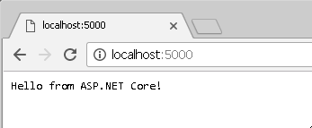
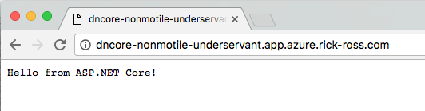

= Lab - Deploying a .NET Core Application

[abstract]
--
In this lab we will push a .NET Core web application to cloud foundry.
--

= Lab - From Zero to Pushing Your First Application

== Target

. If you haven't already, download the latest release of the Cloud Foundry command line interface  (CLI) from https://github.com/cloudfoundry/cli/releases for your operating system and install it.

. Set the API target for the CLI: (set appropriate end point for your environment)
+
----
$ cf api https://api.sys.azure.rick-ross.com --skip-ssl-validation
----

. Login to Pivotal Cloudfoundry:
+
----
$ cf login
----
+
Follow the prompts.  You should have a welcome card with your username and password on it.  If you didn't get one, please ask.

== Install .NET Core

. Download .NET Core from link::https://www.microsoft.com/net/core[] for your operating system
. Note that you might need to open a new shell/termina/command window to run the donet core commands

== Prepare Application

. Change to the pcf-dotnet-core-simple-aspnet folder
+
----
$ cd $BOOTCAMP_HOME/pcf-dotnet-core-simple-aspnet
----

. Restore the .NET Dependencies
+
----
$ dotnet restore
----

. Run it locally 
+
----
$ dotnet run
Project pcf-dotnet-core-simple-aspnet (.NETCoreApp,Version=v1.0) was previously compiled. Skipping compilation.
Hosting environment: Production
Content root path: C:\Users\Rick Ross\pcf-dotnet-core-simple-aspnet\bin\Debug\netcoreapp1.0
Now listening on: http://localhost:5000
Application started. Press Ctrl+C to shut down.
----

Note the URL that the application is running on

. Visit the application in your browser by hitting the URL (e.g. http://localhost:5000)
+

. Press Ctrl-C to exit the application locally 

== Push It!

. Push the application!
+
----
$ cf push
----
+
Note that in this environment, the .NET core buildpack has already been installed. If your system does not have it installed you can specify the buildpack when pushing the app. 
+
You should see output similar to the following listing. 
+
====
----
$ cf push 
Using manifest file /Users/rross/temp/PCF-Workshop-101/pcf-dotnet-core-simple-aspnet/manifest.yml

Creating app dncore in org student7-org / space development as student7...
OK

Creating route dncore-nonmotile-underservant.app.azure.rick-ross.com...
OK

Binding dncore-nonmotile-underservant.app.azure.rick-ross.com to dncore...
OK

Uploading dncore...
Uploading app files from: /Users/rross/temp/PCF-Workshop-101/pcf-dotnet-core-simple-aspnet
Uploading 43.9K, 21 files
Done uploading
OK

Starting app dncore in org student7-org / space development as student7...
Downloading dotnetcore...
Downloading staticfile_buildpack...
Downloading go_buildpack...
Downloading nodejs_buildpack...
Downloading python_buildpack...
Downloaded nodejs_buildpack
Downloading php_buildpack...
Downloaded dotnetcore
Downloading binary_buildpack...
Downloaded staticfile_buildpack
Downloading ruby_buildpack...
Downloaded go_buildpack
Downloading java_buildpack_offline...
Downloaded python_buildpack
Downloaded ruby_buildpack
Downloaded php_buildpack
Downloaded binary_buildpack
Downloaded java_buildpack_offline
Creating container
Successfully created container
Downloading app package...
Downloaded app package (42K)
Staging...
ASP.NET Core buildpack version: 1.0.2
ASP.NET Core buildpack starting compile
-----> Restoring files from buildpack cache
       OK
-----> Extracting libunwind
       libunwind version: 1.1
       file:///tmp/buildpacks/7b5259fd9adbf4d50a6a06afe8937390/dependencies/https___github.com_cloudfoundry-community_dotnet-core-buildpack_releases_download_v0.7_libunwind-cflinuxfs2-1.1.tar.gz
       OK
-----> Installing Dotnet CLI
       dotnet version: 1.0.0-preview2-003131
       file:///tmp/buildpacks/7b5259fd9adbf4d50a6a06afe8937390/dependencies/https___buildpacks.cloudfoundry.org_concourse-binaries_dotnet_dotnet.1.0.0-preview2-003131.linux-amd64.tar.gz
       OK
-----> Restoring dependencies with Dotnet CLI

       Welcome to .NET Core!
       ---------------------
       Learn more about .NET Core @ https://aka.ms/dotnet-docs. Use dotnet --help to see available commands or go to https://aka.ms/dotnet-cli-docs.
       Telemetry
       --------------
       The .NET Core tools collect usage data in order to improve your experience. The data is anonymous and does not include commandline arguments. The data is collected by Microsoft and shared with the community.
       You can opt out of telemetry by setting a DOTNET_CLI_TELEMETRY_OPTOUT environment variable to 1 using your favorite shell.
       You can read more about .NET Core tools telemetry @ https://aka.ms/dotnet-cli-telemetry.
       Configuring...
       -------------------
       A command is running to initially populate your local package cache, to improve restore speed and enable offline access. This command will take up to a minute to complete and will only happen once.
       Decompressing 100% 7861 ms
       Expanding 100% 3869 ms
       log  : Restoring packages for /tmp/app/project.json...
       log  : Installing System.Diagnostics.Contracts 4.0.1.
       log  : Installing System.Text.Encodings.Web 4.0.0.
       log  : Installing System.Net.WebSockets 4.0.0.
       log  : Installing Microsoft.AspNetCore.WebUtilities 1.0.0.
       log  : Installing Microsoft.Extensions.ObjectPool 1.0.0.
       log  : Installing Microsoft.Net.Http.Headers 1.0.0.
       log  : Installing Microsoft.AspNetCore.Http.Abstractions 1.0.0.
       log  : Installing Microsoft.NETCore.App 1.0.0.
       log  : Installing Microsoft.AspNetCore.Http.Features 1.0.0.
       log  : Installing Microsoft.Extensions.DependencyInjection.Abstractions 1.0.0.
       log  : Installing Microsoft.Extensions.FileProviders.Abstractions 1.0.0.
       log  : Installing Microsoft.Extensions.FileSystemGlobbing 1.0.0.
       log  : Installing Microsoft.Extensions.Primitives 1.0.0.
       log  : Installing Microsoft.Extensions.Configuration.CommandLine 1.0.0.
       log  : Installing Microsoft.AspNetCore.Http 1.0.0.
       log  : Installing Microsoft.AspNetCore.Http.Extensions 1.0.0.
       log  : Installing Microsoft.AspNetCore.Hosting.Abstractions 1.0.0.
       log  : Installing Microsoft.AspNetCore.Hosting.Server.Abstractions 1.0.0.
       log  : Installing Microsoft.AspNetCore.Server.Kestrel 1.0.0.
       log  : Installing Microsoft.Extensions.DependencyInjection 1.0.0.
       log  : Installing Microsoft.NETCore.Runtime.CoreCLR 1.0.2.
       log  : Installing Microsoft.Extensions.Configuration 1.0.0.
       log  : Installing Microsoft.Extensions.Logging.Abstractions 1.0.0.
       log  : Installing Microsoft.Extensions.Logging 1.0.0.
       log  : Installing Microsoft.AspNetCore.Hosting 1.0.0.
       log  : Installing Microsoft.NETCore.Jit 1.0.2.
       log  : Installing Microsoft.Extensions.Options 1.0.0.
       log  : Installing Microsoft.Extensions.Configuration.Abstractions 1.0.0.
       log  : Installing Microsoft.Extensions.Configuration.EnvironmentVariables 1.0.0.
       log  : Installing Microsoft.Extensions.FileProviders.Physical 1.0.0.
       log  : Installing Microsoft.Extensions.PlatformAbstractions 1.0.0.
       log  : Writing lock file to disk. Path: /tmp/app/project.lock.json
       log  : ./project.json
       log  : Restore completed in 2461ms.
       OK
-----> Saving to buildpack cache
       Copied 38 files from /tmp/app/libunwind to /tmp/cache
       Copied 211 files from /tmp/app/.dotnet to /tmp/cache
       Copied 8171 files from /tmp/app/.nuget to /tmp/cache
       OK
ASP.NET Core buildpack is done creating the droplet
Exit status 0
Staging complete
Uploading droplet, build artifacts cache...
Uploading build artifacts cache...
Uploading droplet...
Uploaded build artifacts cache (157.8M)
Uploaded droplet (159M)
Uploading complete
Destroying container
Successfully destroyed container

0 of 1 instances running, 1 starting
1 of 1 instances running

App started

OK

App dncore was started using this command `dotnet run --project . --server.urls http://0.0.0.0:${PORT}`

Showing health and status for app dncore in org student7-org / space development as student7...
OK

requested state: started
instances: 1/1
usage: 512M x 1 instances
urls: dncore-nonmotile-underservant.app.azure.rick-ross.com
last uploaded: Mon Oct 24 15:22:15 UTC 2016
stack: cflinuxfs2
buildpack: ASP.NET Core (buildpack-1.0.2)

     state     since                    cpu    memory        disk           details
#0   running   2016-10-24 11:24:12 AM   0.0%   38M of 512M   558.4M of 1G

$
----

. Visit the application in your browser by hitting the route that was generated.
+
 

== Interact with App from CF CLI

. Get information about the currently deployed application using CLI apps command:
+
----
$ cf apps
----
+
Note the application name for next steps

. Scale the app to 2 instances
+
----
$ cf scale dncore -i 2
----

. Get information about running instances, memory, CPU, and other statistics using CLI instances command
+
----
$ cf app dncore
----

. Stop the deployed application using the CLI
+
----
$ cf stop dncore
----

. Delete the deployed application using the CLI
+
----
$ cf delete -r dncore
----
