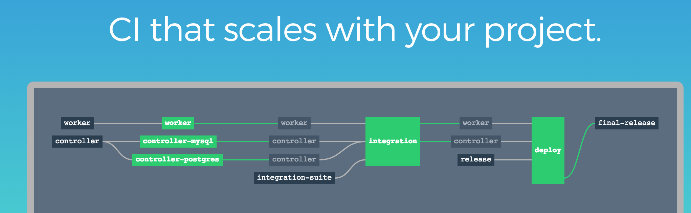
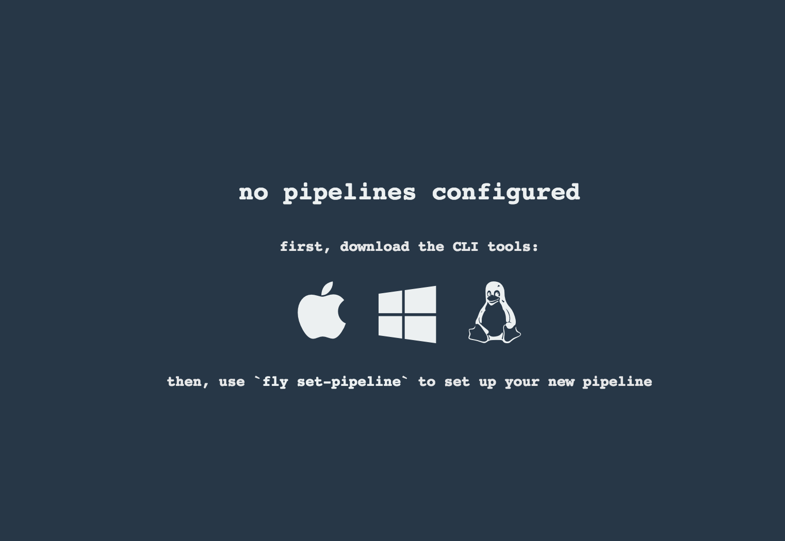
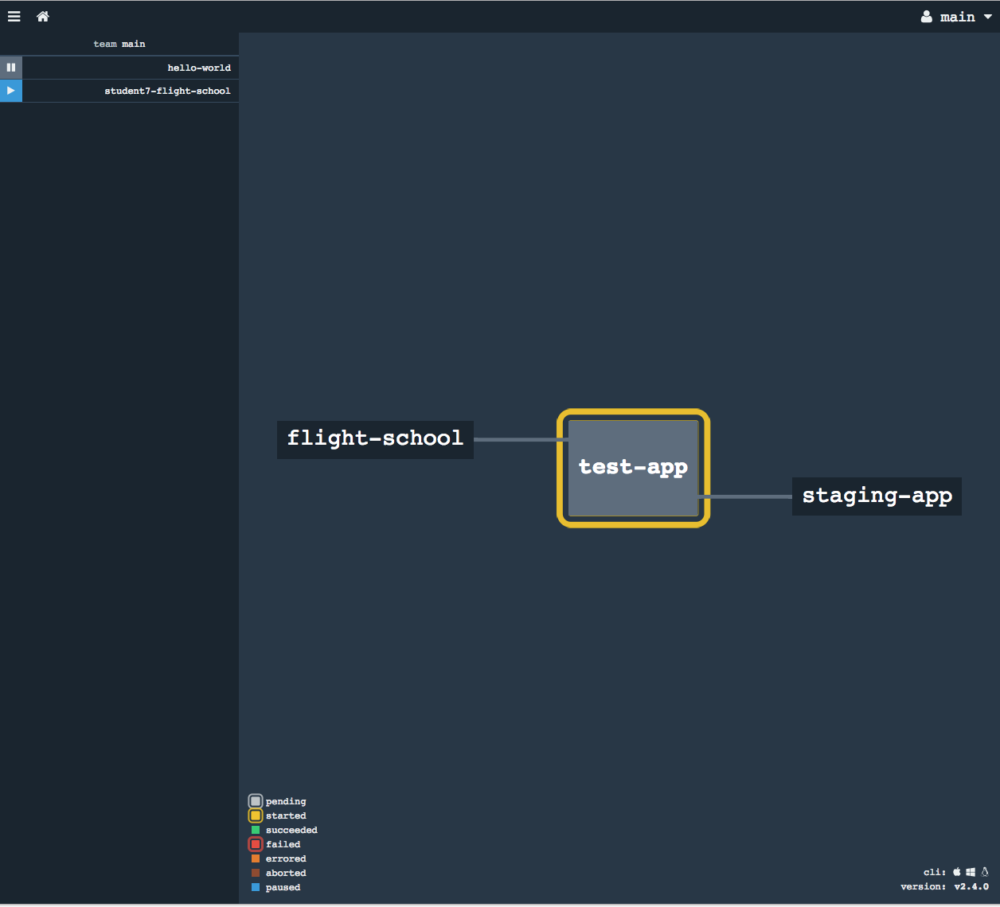
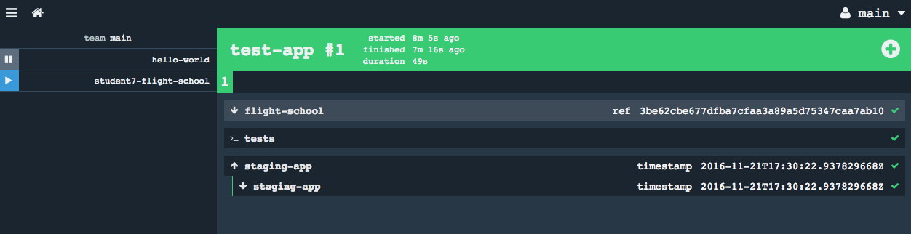
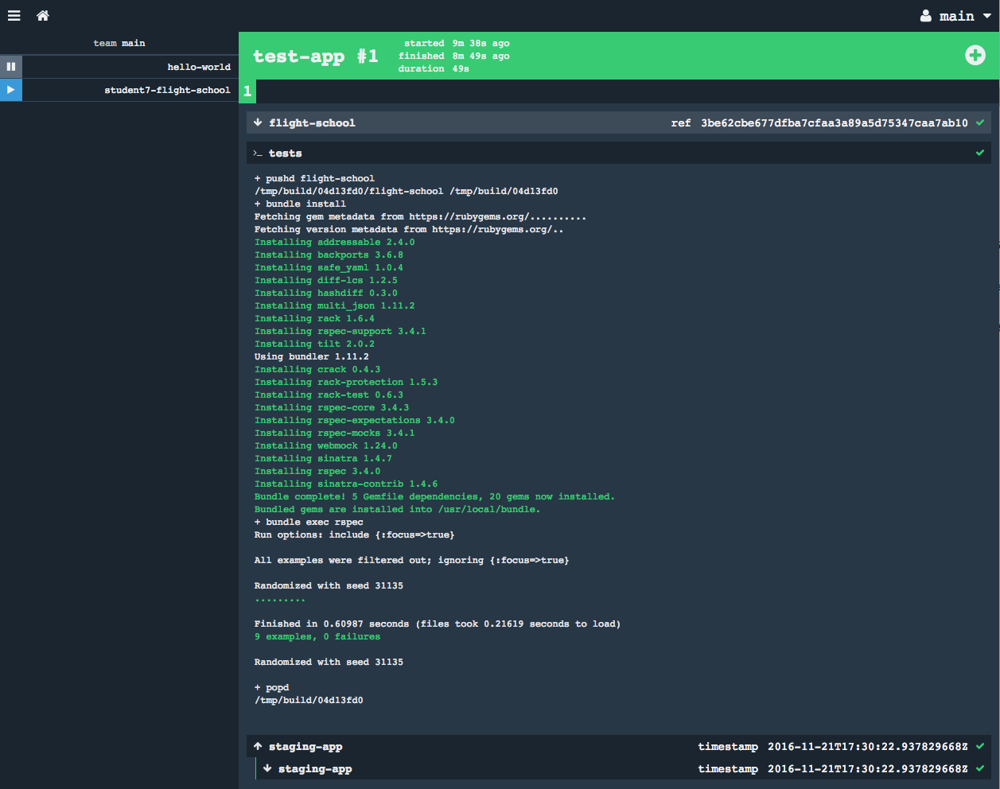
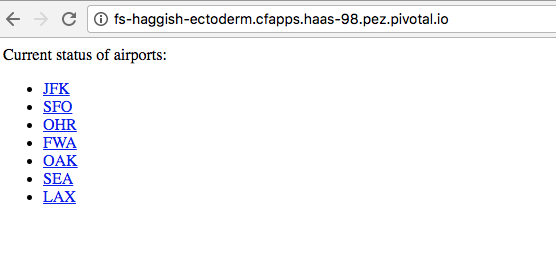
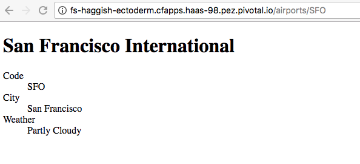
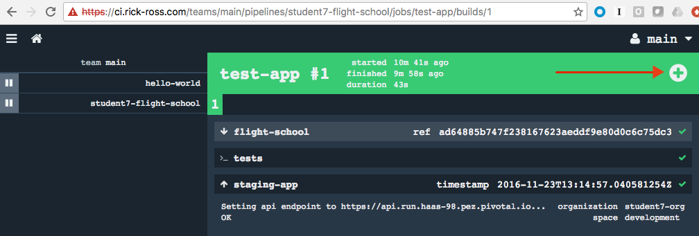

= Lab - Building Pipelines using Concourse.ci

== Goal
In this workshop, you will learn how to build Pipelines for unit testing, staging and production deployment to Pivotal Cloud Foundry using link:http://concourse.ci[Concourse]

== Introduction

Concourse’s end goal is to provide an expressive CI system with as few distinct moving parts as possible.

Concourse CI decouples your project from your CI’s details, and keeping all configuration in declarative files that can be checked into version control.



Concourse limits itself to three core concepts: tasks, resources, and the jobs that compose them. Interesting features like timed triggers and synchronizing usage of external environments are modeled in terms of these, rather than as layers on top.

With these primitives you can model any pipeline, from simple (unit → integration → deploy → ship) to complex (testing on multiple infrastructures, fanning out and in, etc.).

== Prerequisites

1.  Java SDK 1.7+

2.  Pivotal CF Env or Pivotal Web Services Account. If you are walking through this example and are not part of a hands on workshop, you can create a free trial account here http://run.pivotal.io/[Pivotal Web Services]

3.  Optional Vagrant (https://vagrantup.com/[https://vagrantup.com/]) to run Concourse locally

4.  Optional VirtualBox (https://www.virtualbox.org/wiki/Downloads[https://www.virtualbox.org/wiki/Downloads])

5.  Fly CLI. The fly tool is a command line interface to Concourse, which we will download it directly from the Concourse server

== Objectives

The objectives of this workshop are to use Concourse to build pipelines and learn how to trigger actions within a pipeline. Starting with an application in a source code repository, you will build a pipeline that will pull the source code out, build and run unit tests, and deploy to Pivotal Cloud Foundry.

Specifically, you will learn how to

1. Create a Pipeline
2. Trigger a Pipeline using the Fly command line tool
3. Run a pipeline to test, stage and deploy to Pivotal Cloud Foundry

== Target

1. If you haven’t already, download the latest release of the Cloud Foundry CLI from https://github.com/cloudfoundry/cli/releases[CF CLI] for your operating system and install it.

2. Set the API target for the CLI: (set appropriate end point for your environment)
+
```
$ cf api https://api.run.haas-98.pez.pivotal.io --skip-ssl-validation
```
+
3. Login to Pivotal Cloud Foundry
+
```
$ cf login
```
+
Follow the prompts using the credentials given to you during the workshop.

= Building a Simple Pipeline

== Downloading and Installing the Fly Tool

For this section of the lab, you will use a Concourse server that has already been set up for you. If you are interested in installing Concourse on your laptop or within your own infrastructure, read the documentation http://concourse.ci/installing.html[here]

1. Open a browser and navigate to https://ci.rick-ross.com. This server is using self-signed certificates so you can safely ignore the SSL certificate warning(s).
+

+
2. Download the CLI tool by clicking on the icon that represents the operating system you are running. 
3. The file that you download is a fully executable binary. You can move it to a folder that is in your path or specify the full pathname to the fly command as necessary in the following steps. On Mac and Linux systems, you will probably need to mark the file as executable using the following command:
+
```
$ chmod +x fly
```
+
4. Open a terminal / command window and use the fly login command (you might need to specify the full path to the fly executable binary):
+
```
$ fly -t lab login -c https://ci.rick-ross.com -k
```
+
The command that was just executed associates a target, in this case "lab", with the Concourse server. Every command that we use from this point forward will need to reference this "lab" target. The credentials for this lab will be shared during the workshop.
+
5. Similarly, log into Concourse via your browser. Navigate to https://ci.rick-ross.com

6. Click on the login link in the upper right
7. Click on main
8. Enter the username & password for Concourse given out during the Workshop

== Creating Your First Pipeline

For this section of the lab you will use an existing project to create your pipeline which is located in the flight-school folder.

1. Change to the flight-school folder
+
```
$ cd ../flight-school
```
+
Located in the _ci_ folder, there is a properties file called flight-school-properties-sample.yml. This file contains configuration and credential information used by the pipeline. The values contained in this file won't work so we need to customize it for our needs. Seperating out the configuraton and credential information means that we can share the pipeline across teams and avoid sharing sensitive information.
+
3. Make a copy of the flight-school-properties-sample.yml file. This can be located anywhere on your hard drive. Be sure to remember where you place this as you will need to reference this file later on
+
```
$ mkdir myprops
$ cp ci/flight-school-properites-sample.yml myprops/
```
+
On Mac and Linux based systems, change the permissions on the copied file
+
```
$ chmod 600 myprops/flight-school-properties-sample.yml
```
+
4. Edit the myprops/flight-school-properties-sample.yml file and change the following properites:
+
```
*github-uri* - this should match the URL for the git repo in step 1 - https://github.com/rossr3-pivotal/flight-school.git
*cf-api* - this should match the details you have for your workshop environment
*cf-username* - this should be your workshop CF login, e.g. <studentXX>
*cf-password* - this should be your workshop CF password
*cf-org* - this should match your workshop organization, e.g. student-X-org
*cf-space* - this should be one of your spaces in your org, e.g. development
```
+
An example of this file with it filled out looks like this:
+
```
github-uri: https://github.com/rossr3-pivotal/flight-school.git
github-branch: master
cf-api: https://api.run.haas-98.pez.pivotal.io
cf-username: *your student login*
cf-password: *password redacted*
cf-org: student7-org
cf-space: development
```
+
5. Review the pipeline located in ci/pipeline.yml. It is included here for review:
+
```
resources:
- name: flight-school
  type: git
  source:
      uri: {{github-uri}}
      branch: {{github-branch}}
- name: staging-app
  type: cf
  source:
      api: {{cf-api}}
      username: {{cf-username}}
      password: {{cf-password}}
      organization: {{cf-org}}
      space: {{cf-space}}
      skip_cert_check: true

jobs:
- name: test-app
  plan:
  - get: flight-school
    trigger: true
  - task: tests
    file: flight-school/ci/tasks/build.yml
  - put: staging-app
    params:
      manifest: flight-school/manifest.yml
```
+
This pipeline has two resources: a Git resource and a Cloud Foundry resource. The Git resource has a name of _flight-school_ and the Cloud Foundry resource has the name of _staging-app_. 

There is also one job in this pipeline, called _test-app_. This _test-app_ job orchestrates this pipeline by __GET__ting the source code from the flight-school (Git) resource, running the _test_ task which kicks off the build and tests then __PUT__ing results of the build into the staging-app or Cloud Foundry resource. 

The trigger statement in the flight-school section indicates that changes to the underlying Git repository should automatically trigger the job. 

== Set the Pipeline

Upload the pipeline and the configuration to the Concourse server using the set-pipeline command. Be sure to include your student number in the name of your pipeline. In addition, be sure to reference the location of your flight-school-properties-sample.yml file created previously.

In the example below, I am using student7, be sure to change this to your student number

```
$ fly -t lab set-pipeline -p student7-flight-school -c ci/pipeline.yml -l myprops/flight-school-properties-sample.yml
resources:
  resource flight-school has been added:
    name: flight-school
    type: git
    source:
      branch: master
      uri: https://github.com/rossr3-pivotal/flight-school.git

  resource staging-app has been added:
    name: staging-app
    type: cf
    source:
      api: https://api.run.haas-98.pez.pivotal.io
      organization: student7-org
      password: *password redacted*
      skip_cert_check: true
      space: development
      username: student7

jobs:
  job test-app has been added:
    name: test-app
    plan:
    - get: flight-school
      trigger: true
    - task: tests
      file: flight-school/ci/tasks/build.yml
    - put: staging-app
      params:
        manifest: flight-school/manifest.yml

apply configuration? [yN]: y
pipeline created!
you can view your pipeline here: https://ci.rick-ross.com/teams/main/pipelines/instructor-flight-school

the pipeline is currently paused. to unpause, either:
  - run the unpause-pipeline command
  - click play next to the pipeline in the web ui
```
Note that you are asked to confirm the configuration. 

== Testing the Task

Before we run the pipeline, let's validate that the task runs correctly.

1. Use the following command
+
```
$ fly -t lab execute -c ci/tasks/build.yml
executing build 12
  % Total    % Received % Xferd  Average Speed   Time    Time     Time  Current
                                 Dload  Upload   Total   Spent    Left  Speed
100 51200    0 51200    0     0   257k      0 --:--:-- --:--:-- --:--:--  396k
initializing
running flight-school/ci/tasks/build.sh
+ pushd flight-school
/tmp/build/e55deab7/flight-school /tmp/build/e55deab7
+ bundle install
Fetching gem metadata from https://rubygems.org/..........
Fetching version metadata from https://rubygems.org/..
Installing addressable 2.4.0
Installing backports 3.6.8
Installing safe_yaml 1.0.4
Installing diff-lcs 1.2.5
Installing hashdiff 0.3.0
Installing multi_json 1.11.2
Installing rack 1.6.4
Installing rspec-support 3.4.1
Installing tilt 2.0.2
Using bundler 1.11.2
Installing crack 0.4.3
Installing rack-protection 1.5.3
Installing rack-test 0.6.3
Installing rspec-core 3.4.3
Installing rspec-expectations 3.4.0
Installing rspec-mocks 3.4.1
Installing webmock 1.24.0
Installing sinatra 1.4.7
Installing rspec 3.4.0
Installing sinatra-contrib 1.4.6
Bundle complete! 5 Gemfile dependencies, 20 gems now installed.
Bundled gems are installed into /usr/local/bundle.
+ bundle exec rspec
Run options: include {:focus=>true}

All examples were filtered out; ignoring {:focus=>true}

Randomized with seed 48241
.........

Finished in 0.40713 seconds (files took 0.22113 seconds to load)
9 examples, 0 failures

Randomized with seed 48241

+ popd
/tmp/build/e55deab7
succeeded
```
+
The command we just ran was able to successfully execute the build and test script. 

== Trigger the Pipeline & Deploy the App

Before we can run the pipeline, it needs to be unpaused. You can do this from the Concourse User Interface or through the command line. The steps below show how to do this from the command line.

1. To see what pipelines are available run the following command:
+
```
$ fly -t lab pipelines
name                      paused  public
hello-world               no      no
student7-flight-school    yes     no
```
+
Notice that the flight school pipeline is paused.
+
2. To unpause the pipeline use the following command, remembering to substitute your student number instead of the student7 shown below
+
```
$ fly -t lab unpause-pipeline -p student7-flight-school
unpaused 'student7-flight-school'
```
+
3. Now go back to your browser and take a look at the pipeline. It might be running or just starting up
+
You will need to *refresh your browser* and *use the menu in the upper left* to see and then click on your pipeline
+

+
4. Click on the test-app box and you can see the activity of the job. 
+

+
5. You can click on the individual sections to see even more detail. Click on the tests section
+

+
6. Once the pipeline has completed successfully, verify that the app is running in cloud foundry:
+
```
$ $ cf apps
Getting apps in org student7-org / space development as instructor...
OK

name            requested state   instances   memory   disk   urls
flight-school   started           1/1         128M     1G     fs-haggish-ectoderm.cfapps.haas-98.pez.pivotal.io
```
+
7. Copy the URL and paste it into the browser and verify that the application is running:
+

+
8. Click on one of the airports to view the current weather 
+

+
9. Go back to Concourse in your browser and manually kick off a build by clicking the plus button in the upper right
+

+
This kicks off the job again. Notice that there is now a new tab for the build that was kicked off. Concourse keeps the history of each job which provides you with easy access to the details of past executions.
+
A new build can also be started by running the following command. 
+
```
$ fly -t lab trigger-job --job student7-flight-school/test-app
started student7-flight-school/test-app #3
```
+
Note that the format of a job is the name of the pipeline followed by a slash and the name of the job within that pipeline that you want to execute.
+
10. Finally, delete the pipeline with the following command
+
```
$ fly -t lab destroy-pipeline -p student7-flight-school
!!! this will remove all data for pipeline `student7-flight-school`

are you sure? [yN]: y
`student7-flight-school` deleted
```
+
Note that this does not affect any applications running in Pivotal Cloud Foundry. If you wish to delete your flight school application use the following command:
+
```
$ cf delete -r flight-school

Really delete the app flight-school?> yes
Deleting app flight-school in org student7-org / space development as student7...
OK
```
+


